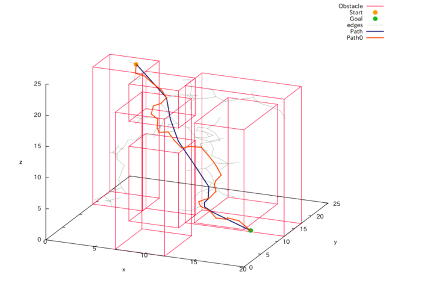
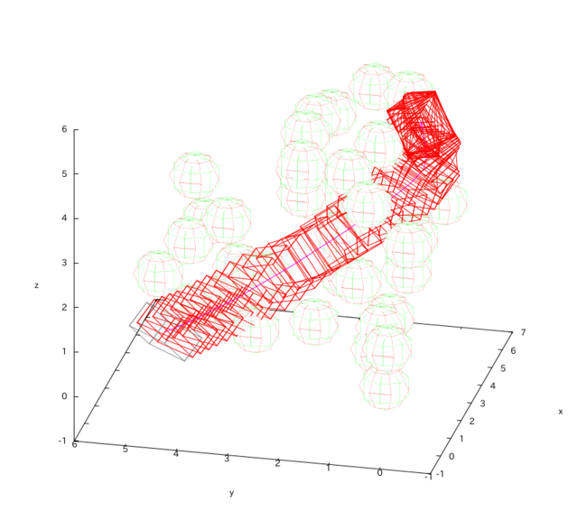
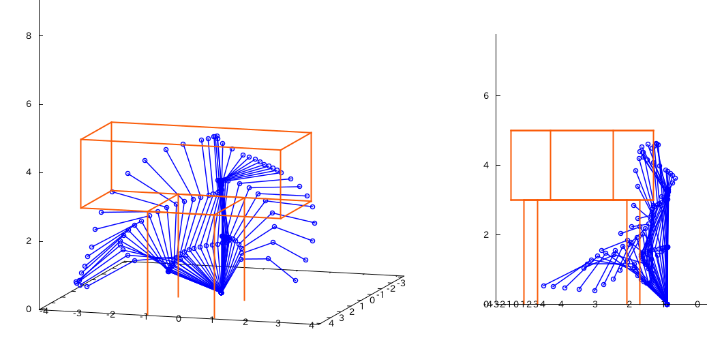

# OMPL Sample
OMPLのサンプルを実行してみるだけのレポジトリだな  
ソースコードは以下のリンクを参考  
[http://robotics.naist.jp/edu/text/?Robotics%2FOMPL#OMPLProgramming](http://robotics.naist.jp/edu/text/?Robotics%2FOMPL#OMPLProgramming)

## プログラムの実行
各プログラムのディレクトリに移動して

```bash
mkdir build
cd build
cmake ..
make
./実行ファイル名
```

## 3次元空間のモーションプランニング


## UAVのモーションプランニング
課題はここから  
[http://robotics.naist.jp/edu/text/?Robotics%2FExercise%2FOMPLProgramming](http://robotics.naist.jp/edu/text/?Robotics%2FExercise%2FOMPLProgramming)  



## マニピュレータのモーションプランニング



## その他もろもろ
